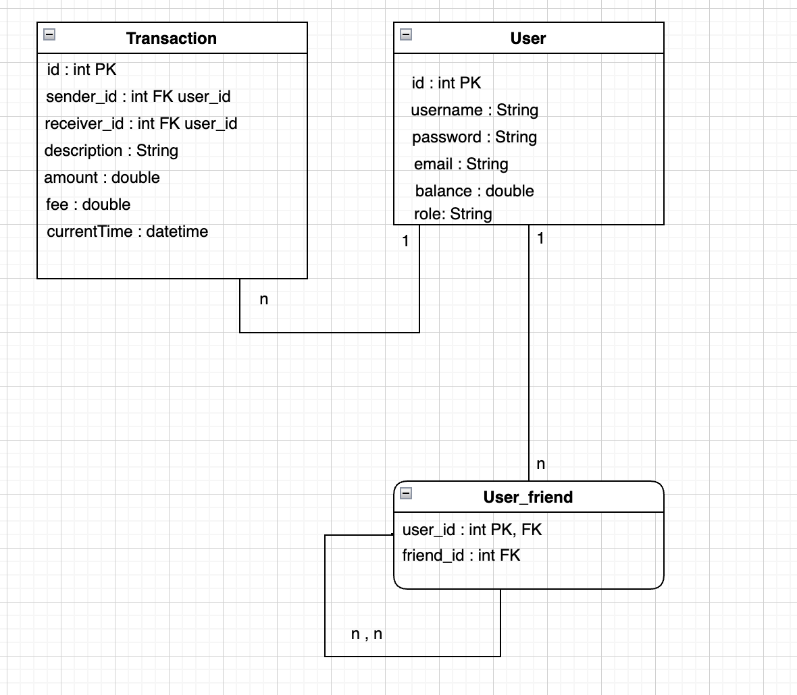

# PayMyBuddy

Voici une capture d’écran représentant le MPD de l'application PayMyBuddy :



## ️ Lancer la base de données

Pour lancer la base de données MySQL avec les tables et les données d'exemple :

1. Démarrez MySQL.
2. Ouvrez un terminal.
3. Exécutez la commande suivante :

```bash
mysql -u root -p < paymybuddy-bdd-save.sql